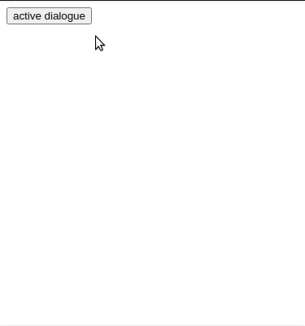

# react-dialogue-component

A simple React component made with styled-components

<p align="center"><p>

## Table of Contents

* [Getting started](#getting-started)
* [Props](#Props)

## Getting started

### Installing
To install, you can use [npm](https://npmjs.org/) or [yarn](https://yarnpkg.com):


    $ npm install --save react-dialogue-component
    $ yarn add react-dialogue-component

### Example
```jsx
  import { Dialogue } from "react-dialogue-component";
  import { useState } from "react";
  
  export default function App() {
  const [dialogue, setDialogue] = useState(false);
  return (
    <div>
      <button
      onClick={() => setDialogue(!dialogue)}
      >
        active dialogue
      </button>
      <Dialogue
        isOpen={dialogue}
        onClose={() => setDialogue(false)}
        closeOnOverlayClick
        title="React Dialogue Demo"
        children="Dialogue example"
      />
    </div>
  );
}
```
[Demo of this example](https://codesandbox.io/s/react-dialogue-demo-jz20gd)

## Props

### Table of Props

| Name | Type | Default | Description | Required
|:-----|:-----|:-----|:-----|:-----|
| title | string | |The title of the dialogue | :x:
| children | ReactNode , string | | The description text for the component to render | :x:
| isOpen | boolean | false | Define if dialogue appear on screen | :heavy_check_mark:
| onClose | function | () => void | Triggerd when the user performs some modal closing action<br> the default actions are called when user press Esc button or click in close button "X" | :heavy_check_mark:
| closeOnOverlayClick | boolean | false | If is true onClose is called when user click on dialogue overlay |  :heavy_check_mark:


